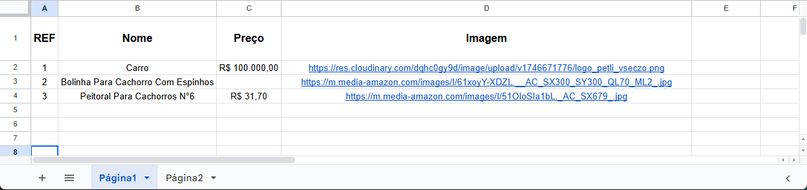
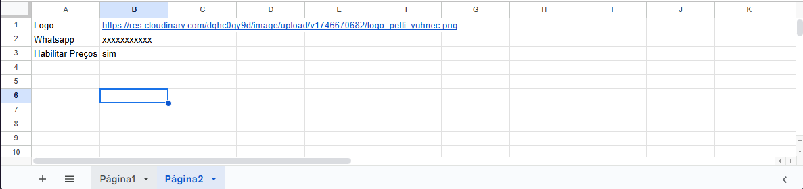

# Catálogo de Produtos

Este é um catálogo de produtos dinâmico que utiliza Cloudinary para hospedagem de imagens, Google Sheets como banco de dados e Netlify para hospedagem.

## Configuração do Projeto

### 1. Configuração do Cloudinary

1. Acesse [Cloudinary Console](https://console.cloudinary.com/app/)
2. Crie uma nova conta gratuita
3. Após criar a conta, você receberá:
   - Cloud name
   - API Key
   - API Secret
4. No painel do Cloudinary:
   - Vá em Settings > Upload
   - Crie um novo upload preset:
     - Nome do preset: `catalogo_produtos`
     - Signing Mode: `Unsigned`
     - Folder: `catalogo_produtos`
     - Format: `Auto`
     - Quality: `Auto`

### 2. Configuração do Google Sheets

1. Acesse [Google Sheets](https://docs.google.com/spreadsheets)
2. Crie uma nova planilha
3. Configure as seguintes colunas:
   - id (número)
   - nome (texto)
   - descricao (texto)
   - preco (número)
   - imagem (texto)
   - categoria (texto)
4. Compartilhe a planilha:
   - Clique em "Compartilhar"
   - Selecione "Qualquer pessoa com o link"
   - Defina como "Visualizador"
   - Copie o link da planilha

#### Exemplo da Estrutura da Planilha

A planilha deve seguir o seguinte formato:





Observações importantes:
- O campo `REF` deve ser único para cada produto
- O campo `Nome` é uma breve descrição do produto
- O campo `Preço` deve ser um número formatado para moeda
- O campo `Imagem` deve conter a URL completa da imagem hospedada no Cloudinary

### 3. Configuração do Google Cloud Platform

1. Acesse [Google Cloud Console](https://console.cloud.google.com/)
2. Crie um novo projeto
3. Ative a Google Sheets API:
   - Vá em "APIs e Serviços" > "Biblioteca"
   - Pesquise por "Google Sheets API"
   - Clique em "Ativar"
4. Crie credenciais:
   - Vá em "APIs e Serviços" > "Credenciais"
   - Clique em "Criar Credenciais" > "Chave de API"
   - Copie a chave de API gerada

### 4. Configuração do Netlify

1. Acesse [Netlify](https://app.netlify.com/)
2. Crie uma nova conta ou faça login
3. Clique em "New site from Git"
4. Selecione o provedor do seu repositório (GitHub, GitLab, etc.)
5. Selecione o repositório do catálogo
6. Configure as variáveis de ambiente:
   - Vá em "Site settings" > "Build & deploy" > "Environment"
   - Adicione as seguintes variáveis:
     ```
     VITE_CLOUDINARY_CLOUD_NAME=seu_cloud_name
     VITE_CLOUDINARY_UPLOAD_PRESET=catalogo_produtos
     VITE_GOOGLE_SHEETS_API_KEY=sua_chave_api
     VITE_GOOGLE_SHEETS_ID=id_da_sua_planilha
     ```
7. Configure o build:
   - Build command: `npm run build`
   - Publish directory: `dist`
8. Clique em "Deploy site"

## Estrutura do Projeto

```
catalogo_produtos/
├── src/
│   ├── components/
│   ├── pages/
│   ├── services/
│   └── App.jsx
├── public/
├── index.html
└── package.json
```

## Tecnologias Utilizadas

- React
- Vite
- Cloudinary
- Google Sheets API
- Netlify

## Desenvolvimento Local

1. Clone o repositório
2. Instale as dependências:
   ```bash
   npm install
   ```
3. Crie um arquivo `.env` na raiz do projeto com as variáveis de ambiente:
   ```
   VITE_CLOUDINARY_CLOUD_NAME=seu_cloud_name
   VITE_CLOUDINARY_UPLOAD_PRESET=catalogo_produtos
   VITE_GOOGLE_SHEETS_API_KEY=sua_chave_api
   VITE_GOOGLE_SHEETS_ID=id_da_sua_planilha
   ```
4. Inicie o servidor de desenvolvimento:
   ```bash
   npm run dev
   ```

## Contribuição

1. Faça um fork do projeto
2. Crie uma branch para sua feature (`git checkout -b feature/nova-feature`)
3. Commit suas mudanças (`git commit -m 'Adiciona nova feature'`)
4. Push para a branch (`git push origin feature/nova-feature`)
5. Abra um Pull Request

## Licença

Este projeto está sob a licença MIT. Veja o arquivo [LICENSE](LICENSE) para mais detalhes.
